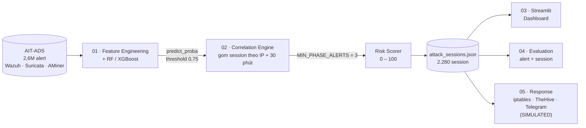
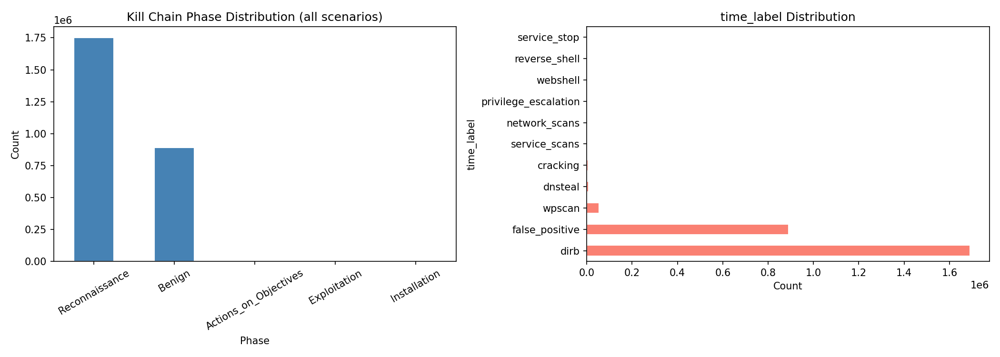
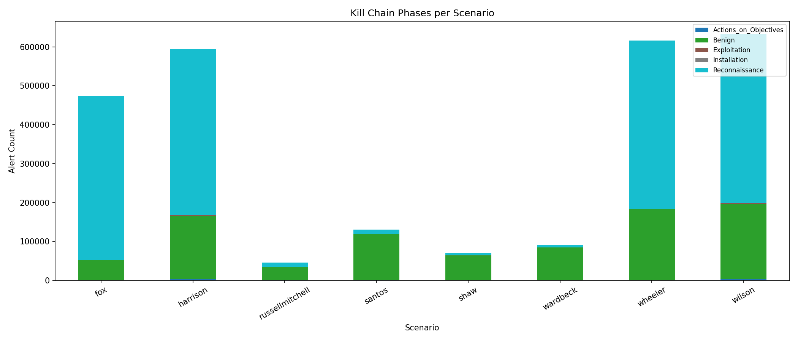
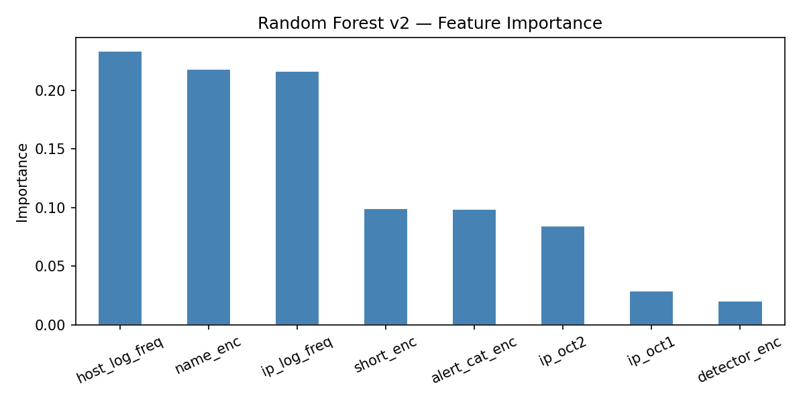
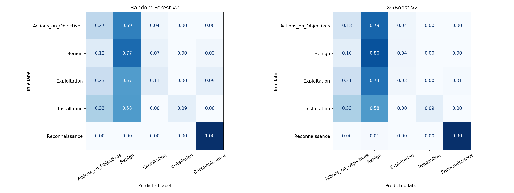
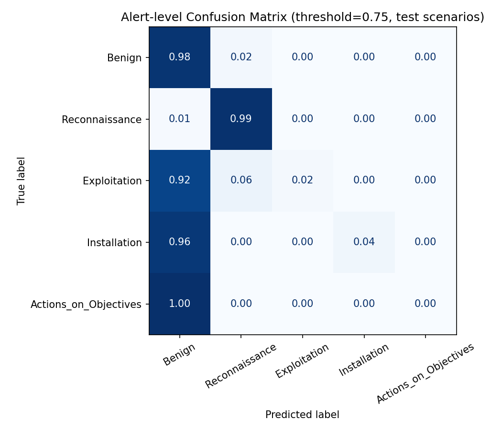
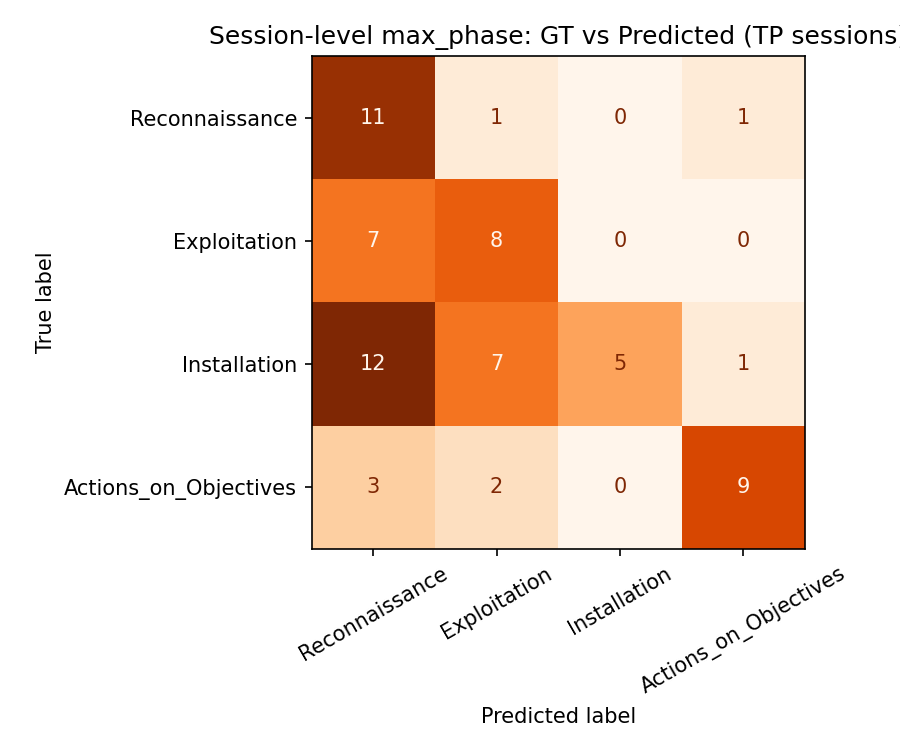

<div align="center">

# 🛡️ Kill Chain SIEM AI

**Hệ thống SIEM ứng dụng AI tự động phân tích tấn công theo mô hình Cyber Kill Chain**

Đề tài môn **Giám sát An ninh Mạng (GSANM)**


**2.655.821 alert → 2.280 attack session → 95 session cần điều tra ngay**

</div>

---

## Mục lục

1. [Bài toán](#bài-toán)
2. [Kết quả nổi bật](#kết-quả-nổi-bật)
3. [Kiến trúc hệ thống](#kiến-trúc-hệ-thống)
4. [Dataset](#dataset)
5. [Các bước đã thực hiện](#các-bước-đã-thực-hiện)
   - [Bước 1 — EDA & huấn luyện mô hình](#bước-1--eda--huấn-luyện-mô-hình)
   - [Bước 2 — Correlation Engine](#bước-2--correlation-engine)
   - [Bước 3 — Dashboard](#bước-3--dashboard)
   - [Bước 4 — Đánh giá end-to-end](#bước-4--đánh-giá-end-to-end)
   - [Bước 5 — Response module](#bước-5--response-module-mô-phỏng)
6. [Ví dụ một cuộc tấn công được phát hiện](#ví-dụ-một-cuộc-tấn-công-được-phát-hiện)
7. [Hạn chế & hướng phát triển](#hạn-chế--hướng-phát-triển)
8. [Cài đặt & chạy](#cài-đặt--chạy)
9. [Cấu trúc thư mục](#cấu-trúc-thư-mục)

---

## Bài toán

Một hệ thống SIEM thực tế nhận **hàng triệu cảnh báo** từ nhiều IDS khác nhau. Phần lớn là nhiễu hoặc cảnh báo sai, khiến chuyên viên SOC bị quá tải (*alert fatigue*) và dễ bỏ lọt các cuộc tấn công nhiều bước thực sự nguy hiểm.

Project này xây dựng một pipeline tự động trả lời 3 câu hỏi:

| Câu hỏi | Thành phần giải quyết |
|---|---|
| Alert này thuộc **giai đoạn tấn công** nào? | Mô hình ML phân loại alert → Kill Chain phase |
| Những alert nào thuộc **cùng một cuộc tấn công**? | Correlation Engine gom alert thành attack session |
| Cuộc tấn công nào **cần xử lý trước**? | Risk scoring + playbook phản ứng |

### Ánh xạ Cyber Kill Chain

Mô hình Kill Chain được rút gọn còn **4 giai đoạn tấn công + 1 lớp Benign**, khớp với các nhãn có trong dataset:

| Nhãn gốc (`time_label`) | Kill Chain Phase | Ý nghĩa | Risk base |
|---|---|---|:---:|
| `dirb`, `wpscan`, `network_scans`, `service_scans` | 🔍 **Reconnaissance** | Dò quét mạng, dịch vụ, web | 15 |
| `cracking`, `privilege_escalation` | 💥 **Exploitation** | Brute-force, leo thang đặc quyền | 50 |
| `webshell`, `reverse_shell` | 🧩 **Installation** | Cài webshell / reverse shell | 75 |
| `dnsteal`, `service_stop` | 🎯 **Actions_on_Objectives** | Đánh cắp dữ liệu qua DNS, dừng dịch vụ | 90 |
| `false_positive` | ✅ **Benign** | Hoạt động bình thường | 0 |

---

## Kết quả nổi bật

| Chỉ số | Giá trị |
|---|---|
| Giảm khối lượng alert → session | **~1.165 lần** (2.655.821 → 2.280) |
| Giảm khối lượng cần điều tra ngay | **~27.956 lần** (→ 95 session HIGH/CRITICAL) |
| Accuracy phân loại alert (test, RF v2) | **95%** (argmax) · **98,2%** (sau threshold 0,75) |
| Precision / Recall / F1 nhị phân cấp alert | **0,994 / 0,984 / 0,989** |
| Thời gian phát hiện đầu tiên (trung vị) | **0,2 phút** |
| Session kích hoạt playbook phản ứng | **251** (93 CRITICAL · 2 HIGH · 156 MEDIUM) |

> [!IMPORTANT]
> Các con số trên cần đọc kèm phần [Hạn chế](#hạn-chế--hướng-phát-triển): precision cấp session còn thấp (0,167 trên tập test) và recall của các lớp thiểu số ở cấp alert gần bằng 0 sau khi áp threshold.

---

## Kiến trúc hệ thống



Code được tổ chức theo hướng **OOP**: toàn bộ logic nghiệp vụ nằm trong package `siem/`, 5 script `0N_*.py` ở thư mục gốc chỉ điều phối các class theo đúng thứ tự và in kết quả, không lặp lại code.

| Module | Class | Vai trò |
|---|---|---|
| `siem/killchain.py` | `KillChain` | Nguồn sự thật duy nhất: mapping nhãn → phase, thứ tự Kill Chain, risk base |
| `siem/data.py` | `AlertDataLoader` | Đọc + làm sạch alert thô theo scenario |
| `siem/features.py` | `FeatureEngineer` | `fit_transform` (train) / `transform` (inference) |
| `siem/model.py` | `ModelTrainer`, `ThresholdedPredictor`, `ThresholdTuner` | Huấn luyện model, dự đoán có threshold cấp alert |
| `siem/session.py` | `SessionBuilder`, `SessionThresholdTuner` | Gom session, threshold cấp session |
| `siem/risk.py` | `RiskScorer` | Tính `risk_score`, `risk_level`, `recommended_action` |
| `siem/evaluation.py` | `SessionEvaluator` | TP/FP/FN/TN, precision/recall/F1 dùng chung |
| `siem/response.py` | `ResponsePlaybook`, `ResponseExecutor` | Sinh playbook phản ứng (mô phỏng) |

> [!NOTE]
> Sau khi refactor sang OOP, toàn bộ pipeline đã được chạy lại từ đầu (train lại model) và so sánh từng file output với bản trước refactor — kết quả **giống hệt nhau từng byte**.

---

## Dataset

**[AIT Alert Data Set (AIT-ADS)](https://zenodo.org/record/8263181)** — alert từ 3 IDS: **Wazuh (W)**, **Suricata (S)**, **AMiner (A)**, sinh ra trên [AIT Log Data Set V2.0](https://zenodo.org/record/5789064) gồm 8 kịch bản tấn công mô phỏng trong lab.

Mỗi alert gồm các trường: `time, name, ip, host, short, time_label, event_label`
(`short` là mã rút gọn, ví dụ `W-Acc-400` = *Wazuh: Web server 400 error code*).

| Scenario | Số alert | Vai trò | | Scenario | Số alert | Vai trò |
|---|---:|:---:|---|---|---:|:---:|
| fox | 473.104 | 🧪 **Test** | | shaw | 70.782 | Train |
| harrison | 593.948 | 🧪 **Test** | | wardbeck | 91.257 | Train |
| russellmitchell | 45.544 | Train | | wheeler | 616.161 | Train |
| santos | 130.779 | Train | | wilson | 634.246 | Train |

**Tổng: 2.655.821 alert** · Train 1.588.769 · Test 1.067.052

---

## Các bước đã thực hiện

### Bước 1 — EDA & huấn luyện mô hình

> Script: `01_eda_train.py`

#### 1.1 Phân tích khám phá dữ liệu

<p align="center"></p>

| Kill Chain Phase | Số alert | Tỉ lệ |
|---|---:|---:|
| Reconnaissance | 1.749.954 | 65,90% |
| Benign | 891.240 | 33,56% |
| Actions_on_Objectives | 8.651 | 0,33% |
| Exploitation | 5.773 | 0,22% |
| Installation | **203** | **0,008%** |

**Nhận xét:**
- Dữ liệu **mất cân bằng cực độ**. Riêng công cụ `dirb` sinh ~1,6 triệu alert lỗi HTTP 400, chiếm gần 2/3 dataset.
- Installation chỉ có 203 mẫu trên toàn bộ 2,65 triệu alert → giới hạn cứng của dữ liệu, ảnh hưởng mọi kết quả phía sau.

<p align="center"></p>

#### 1.2 Chia train/test theo scenario — không chia ngẫu nhiên

IP/host nội bộ lặp lại trong cùng một scenario. Nếu chia ngẫu nhiên, model gặp lại đúng IP đó ở tập test và cho **accuracy ảo ~99%**. Vì vậy dữ liệu được chia theo scenario: **train 6 scenario, test `fox` + `harrison`** — đo đúng khả năng tổng quát hoá sang một môi trường chưa từng thấy.

#### 1.3 Feature engineering — phát hiện và loại bỏ data leakage

**Phiên bản v1** dùng thêm `hour` và `day_of_week`. Hai feature này chiếm **47,6% importance**, nhưng accuracy trên tập test chỉ **59%**.

> [!WARNING]
> **Data leakage:** trong lab, mỗi kịch bản tấn công chạy theo lịch cố định. Model học *"tấn công xảy ra lúc mấy giờ"* thay vì *"alert này trông như thế nào"* → thất bại hoàn toàn khi chuyển sang scenario khác. Hai feature thời gian đã bị loại bỏ.

**Phiên bản v2 (final)** — 8 feature:

| Feature | Cách tính | Importance |
|---|---|:---:|
| `host_log_freq` | `log1p(số alert của host trong cùng scenario)` | 23,3% |
| `name_enc` | Label-encode tên alert đầy đủ | 21,8% |
| `ip_log_freq` | `log1p(số alert của IP trong cùng scenario)` | 21,7% |
| `short_enc` | Label-encode mã alert (`W-Acc-400`, `S-Dns-Qry3`…) | 9,9% |
| `alert_cat_enc` | Phần giữa của `short` (`Acc`, `Dns`, `Tls`…) | 9,9% |
| `ip_oct2` | Octet thứ 2 của IP (subnet) | 8,4% |
| `ip_oct1` | Octet thứ 1 của IP | 2,9% |
| `detector_enc` | Ký tự đầu của `short`: `W` / `S` / `A` | 2,0% |

<p align="center"></p>

**Vì sao `ip_log_freq` hiệu quả:** một IP chạy `dirb` tạo 400.000 alert → `log(400001) ≈ 12,9`; một IP bình thường tạo 10 alert → `log(11) ≈ 2,4`. Log hoá giúp tách rõ IP tấn công mà không bị giá trị cực lớn lấn át.

Không dùng `StandardScaler` vì Random Forest và XGBoost là mô hình cây, không nhạy với thang đo.

#### 1.4 Huấn luyện mô hình

| Mô hình | Cấu hình | Xử lý mất cân bằng |
|---|---|---|
| Random Forest | 300 cây, `max_depth=20` | `class_weight="balanced"` |
| XGBoost | 400 vòng, `lr=0.1`, `max_depth=8` | `compute_sample_weight("balanced")` |

**F1-score trên tập test (fox + harrison):**

| Phase | RF v1 | RF v2 | XGB v2 | Support |
|---|:---:|:---:|:---:|---:|
| Reconnaissance | 0,66 | **0,99** | **1,00** | 847.529 |
| Benign | 0,49 | 0,86 | **0,90** | 213.907 |
| Actions_on_Objectives | 0,00 | 0,06 | 0,05 | 3.635 |
| Exploitation | 0,01 | 0,02 | 0,01 | 1.926 |
| Installation | 0,02 | **0,14** | 0,04 | 55 |
| **Accuracy** | 0,59 | **0,95** | **0,96** | 1.067.052 |

<p align="center"></p>

**Kết luận bước 1:**
- Loại bỏ leakage đưa accuracy từ **59% → 95–96%**.
- Chọn **Random Forest v2** làm model production: tốt hơn rõ ở Installation (0,14 so với 0,04) và dễ giải thích.
- 3 lớp thiểu số vẫn yếu vì ở cấp **một alert đơn lẻ** model thiếu ngữ cảnh: một lần brute-force trông như đăng nhập thất bại bình thường, một truy vấn DNS exfiltration trông như DNS thường → cần **tương quan nhiều alert** ở bước 2.

---

### Bước 2 — Correlation Engine

> Script: `02_correlation_engine.py`

#### 2.1 Gom alert thành attack session

- Nhóm alert theo **IP nguồn**, sắp xếp theo thời gian.
- IP im lặng quá **30 phút** → bắt đầu session mới.
- Session có **< 2 alert** bị loại như nhiễu.
- Mỗi session lưu tiến trình Kill Chain: các phase đạt được, thời điểm xuất hiện đầu tiên, số alert và alert tiêu biểu của từng phase.

#### 2.2 Threshold tuning 2 lớp

Dự đoán `argmax` mặc định sinh quá nhiều alert tấn công giả. Hai ngưỡng được bổ sung và tune bằng grid search:

| Lớp | Tham số | Giá trị chọn | Cơ chế |
|---|---|:---:|---|
| **Alert-level** | `threshold` | **0,75** | Chỉ nhận nhãn tấn công khi `max(predict_proba) ≥ 0,75`, ngược lại quy về Benign |
| **Session-level** | `MIN_PHASE_ALERTS` | **3** | Một phase trong session chỉ được công nhận khi có ≥ 3 alert — một alert lẻ bị gán nhầm không thể làm cả session bị coi là tấn công |

**Kết quả:**
- Alert-level (nhị phân tấn công / bình thường): precision **0,994**, recall **0,984**, F1 **0,989**.
- Session-level precision: **0,089 → 0,167** trên tập test (0,193 trên cả 8 scenario).

#### 2.3 Chấm điểm rủi ro

```
risk_score = base (phase nguy hiểm nhất: 15 / 50 / 75 / 90)
           + 10 × (số phase − 1)                    ← multi-phase
           + 15 / 25 / 35 nếu đạt 2 / 3 / 4 phase    ← tiến triển theo Kill Chain
           + min(5, alert_count // 10000)          ← khối lượng
           (giới hạn tối đa 100)
```

| Risk level | Ngưỡng | Hành động đề xuất | Số session |
|---|:---:|---|---:|
| 🔴 CRITICAL | ≥ 80 | Cô lập host + chặn IP | 93 |
| 🟠 HIGH | ≥ 60 | Chặn IP nguồn | 2 |
| 🟡 MEDIUM | ≥ 30 | Giám sát IP | 156 |
| 🔵 LOW | > 0 | Không cần hành động | 96 |
| ⚪ BENIGN | 0 | — | 1.933 |
| | | **Tổng** | **2.280** |

**Output:** `attack_sessions.json`, `attack_sessions_high_risk.json`, `sessions_summary.csv`

---

### Bước 3 — Dashboard

> Script: `03_dashboard.py` · chạy: `streamlit run 03_dashboard.py`

Dashboard Streamlit giúp chuyên viên SOC đi từ bức tranh toàn cục xuống từng cuộc tấn công:

- **Bộ lọc (sidebar):** scenario, risk level, chỉ session multi-phase, tìm theo source IP
- **Tổng quan:** các chỉ số chính, phân bố risk level, phase cao nhất đạt được
- **Theo scenario:** số session của từng scenario, chia theo risk level
- **Danh sách attack session** có thể sắp xếp, lọc
- **Kill Chain timeline** chi tiết của từng session
- **Đánh giá Correlation Engine** ngay trên dashboard

---

### Bước 4 — Đánh giá end-to-end

> Script: `04_evaluate_pipeline.py`

#### 4.1 Cấp alert (tập test, threshold 0,75)

| Phase | Precision | Recall | F1 | Support |
|---|:---:|:---:|:---:|---:|
| Benign | 0,94 | 0,98 | 0,96 | 213.907 |
| Reconnaissance | 0,99 | 0,99 | 0,99 | 847.529 |
| Exploitation | 0,92 | ⚠️ **0,02** | 0,04 | 1.926 |
| Installation | 0,50 | ⚠️ **0,04** | 0,07 | 55 |
| Actions_on_Objectives | 0,00 | ⚠️ **0,00** | 0,00 | 3.635 |
| **Accuracy / Macro F1** | | | **0,982 / 0,41** | 1.067.052 |

<p align="center"></p>

> [!CAUTION]
> Accuracy 98,2% **che giấu một đánh đổi lớn**: threshold 0,75 gần như xoá sổ recall của 3 lớp thiểu số — các alert này hiếm khi đạt độ tin cậy 0,75 nên bị quy về Benign. Threshold được chọn để tối ưu F1 **nhị phân**, không phải recall theo từng lớp.

#### 4.2 Cấp session

| Phạm vi | TP | FP | FN | TN | Precision | Recall | F1 |
|---|---:|---:|---:|---:|:---:|:---:|:---:|
| Test (fox, harrison) | 11 | 55 | 21 | 463 | 0,167 | 0,344 | 0,224 |
| Cả 8 scenario | 67 | 280 | 66 | 1.867 | 0,193 | 0,504 | 0,279 |

- **Phase agreement** (phase cao nhất dự đoán = thực tế) trong các session TP: **49,3%**
- **Recall với session multi-phase:** 0,14

<details>
<summary><b>Kết quả theo từng scenario</b></summary>

| Scenario | Split | Sessions | Session tấn công (GT) | Precision | Recall | F1 |
|---|:---:|---:|---:|:---:|:---:|:---:|
| fox | test | 322 | 20 | 0,154 | 0,400 | 0,222 |
| harrison | test | 228 | 12 | 0,214 | 0,250 | 0,231 |
| russellmitchell | train | 242 | 20 | 0,224 | 0,550 | 0,319 |
| santos | train | 217 | 20 | 0,367 | 0,550 | 0,440 |
| shaw | train | 294 | 12 | 0,064 | 0,417 | 0,111 |
| wardbeck | train | 350 | 13 | 0,225 | 0,692 | 0,340 |
| wheeler | train | 302 | 18 | 0,345 | 0,556 | 0,426 |
| wilson | train | 325 | 18 | 0,182 | 0,556 | 0,274 |

</details>

<p align="center"></p>

#### 4.3 Giá trị vận hành

| Chỉ số | Giá trị |
|---|---|
| Alert thô → session | 2.655.821 → 2.280 (**~1.165×**) |
| Session HIGH/CRITICAL cần điều tra ngay | **95** (**~27.956×** so với alert thô) |
| Time-to-first-detection — trung vị | **0,2 phút** |
| Time-to-first-detection — trung bình | 65,9 phút (lệch phải mạnh, vài session phát hiện rất trễ) |
| Time-to-max-phase (multi-phase) — trung vị | 2,7 phút |

Đây là đóng góp rõ ràng nhất của hệ thống: thay vì 2,6 triệu cảnh báo, chuyên viên chỉ cần xem **95 session** ưu tiên cao, và phần lớn tấn công được phát hiện gần như tức thời.

---

### Bước 5 — Response module (mô phỏng)

> Script: `05_response.py`

Khi một session đạt giai đoạn **Exploitation trở lên**, hệ thống sinh playbook gồm 3 hành động:

| Hành động | Nội dung |
|---|---|
| 🚫 Chặn IP | Lệnh `iptables -A INPUT -s <ip> -j DROP` |
| 📋 Case TheHive | Payload đúng format API thật: `title`, `description`, `severity` (1–4), `artifacts`… |
| 📨 Cảnh báo | Nội dung tin nhắn Telegram / Email |

**Kết quả:** 251 / 2.280 session kích hoạt phản ứng (93 CRITICAL · 2 HIGH · 156 MEDIUM).

> [!NOTE]
> **Toàn bộ là SIMULATION.** Dataset là log lịch sử, IP là IP nội bộ lab không tồn tại ngoài đời, và đề tài không có hạ tầng TheHive / firewall / Telegram thật. `ResponseExecutor` chỉ ghi payload ra `output/response_actions.json`, **không** gọi `subprocess` hay HTTP. Vì payload khớp format API thật, có thể nối vào hạ tầng thật chỉ bằng cách thay thân hàm `ResponseExecutor.run`.

---

## Ví dụ một cuộc tấn công được phát hiện

Session `harrison-192.168.131.215-1644304580` (tập **test**) — phát hiện đúng cả 3 giai đoạn so với ground truth:

| Phase | Số alert | Alert tiêu biểu |
|---|---:|---|
| 🔍 Reconnaissance | 423.451 | `W-Acc-400` — Web server 400 error (dirb) |
| 💥 Exploitation | 32 | `A-Aud-Com6` |
| 🧩 Installation | 4 | `A-Acc-Ent2` |

- Thời lượng: **80,8 phút** · Tổng: **424.864 alert** gom thành **1 session**
- Risk score: **100 / 100 → CRITICAL** · Hành động: *ISOLATE host + BLOCK 192.168.131.215*

Playbook được sinh ra:

```text
[CRITICAL] Attack session harrison-192.168.131.215-1644304580
Scenario: harrison  |  Source IP: 192.168.131.215
Kill Chain: Reconnaissance → Exploitation → Installation
Start: 2022-02-08 07:16:20 UTC  |  Duration: 80.8 min  |  Alerts: 424864
Risk score: 100/100
Recommended action: ISOLATE host + BLOCK 192.168.131.215
```

```json
{
  "title": "Attack Session Detected - Kill Chain Escalation (Installation)",
  "severity": 4,
  "source": "AI-SIEM-Correlation-Engine",
  "sourceRef": "harrison-192.168.131.215-1644304580",
  "artifacts": [{ "dataType": "ip", "data": "192.168.131.215" }]
}
```

---

## Hạn chế & hướng phát triển

| Hạn chế | Nguyên nhân | Hướng cải thiện |
|---|---|---|
| **Precision cấp session thấp (0,167)** | 51/55 session FP trên tập test bị gán nhầm Reconnaissance do 2 mã alert `W-All-Evt` và `W-Acc-Cms` — ở train gắn với trinh sát, ở fox/harrison lại xuất hiện trong ngữ cảnh bình thường | Xem lại feature engineering, thêm feature ngữ cảnh; threshold không sửa được lỗi này |
| **Lớp thiểu số gần như "mù" ở cấp alert** | Quá ít mẫu (Installation 203) + một threshold chung 0,75 | Threshold riêng cho từng lớp; feature theo cửa sổ thời gian (số lần đăng nhập thất bại từ cùng IP trong N phút) |
| **Threshold được tune trên tập test** | Không tách tập validation riêng | Leave-one-scenario-out trên tập train để có ước lượng khách quan |
| **Response chỉ là mô phỏng** | Không có hạ tầng thật | Nối `ResponseExecutor` với TheHive / firewall / Telegram bot thật |
| **Dữ liệu lab lịch sử** | AIT-ADS là log mô phỏng | Kiểm chứng trên dữ liệu thực tế và luồng alert thời gian thực |

---

## Cài đặt & chạy

### Yêu cầu

- Python **3.13**

### Cài đặt

```bash
git clone https://github.com/wotttoo/killchain-siem-ai.git
cd killchain-siem-ai
pip install -r requirements.txt
```

### Chuẩn bị dataset

Dataset không nằm trong repo (~252 MB). Tải `alerts_csv` từ [Zenodo — AIT-ADS](https://zenodo.org/record/8263181) và giải nén để có cấu trúc:

```
alert-data-set-main/alerts_csv/alerts_csv/
├── fox_alerts.txt
├── harrison_alerts.txt
├── russellmitchell_alerts.txt
├── santos_alerts.txt
├── shaw_alerts.txt
├── wardbeck_alerts.txt
├── wheeler_alerts.txt
└── wilson_alerts.txt
```

### Chạy pipeline

Chạy lần lượt theo thứ tự (mỗi bước dùng output của bước trước):

```bash
python 01_eda_train.py            # EDA + train model  → output/model_rf_v2.pkl, encoders
python 02_correlation_engine.py   # gom session + risk → output/attack_sessions.json
streamlit run 03_dashboard.py     # mở dashboard tại http://localhost:8501
python 04_evaluate_pipeline.py    # đánh giá           → output/pipeline_eval_metrics.json
python 05_response.py             # playbook mô phỏng  → output/response_actions.json
```

> [!TIP]
> Các file model `*.pkl` không được đưa lên repo (tổng ~73 MB). Chạy `01_eda_train.py` để sinh lại trước khi chạy các bước sau.

---

## Cấu trúc thư mục

```
killchain-siem-ai/
├── 01_eda_train.py              # Bước 1: EDA + train RF/XGBoost
├── 02_correlation_engine.py     # Bước 2: phân loại alert, gom session, chấm risk
├── 03_dashboard.py              # Bước 3: Streamlit dashboard
├── 04_evaluate_pipeline.py      # Bước 4: đánh giá end-to-end
├── 05_response.py               # Bước 5: playbook phản ứng (mô phỏng)
├── siem/                        # Package chứa toàn bộ logic nghiệp vụ
│   ├── killchain.py
│   ├── data.py
│   ├── features.py
│   ├── model.py
│   ├── session.py
│   ├── risk.py
│   ├── evaluation.py
│   └── response.py
├── output/                      # Kết quả: biểu đồ, session, metrics, response
├── requirements.txt
└── README.md
```

---

<div align="center">

**Đề tài môn Giám sát An ninh Mạng** · Dataset: [AIT-ADS](https://zenodo.org/record/8263181) (Austrian Institute of Technology)

</div>
